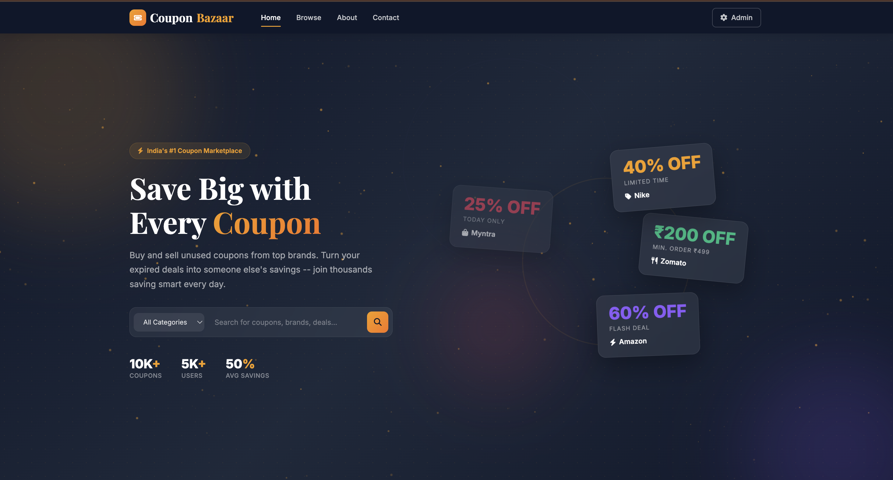
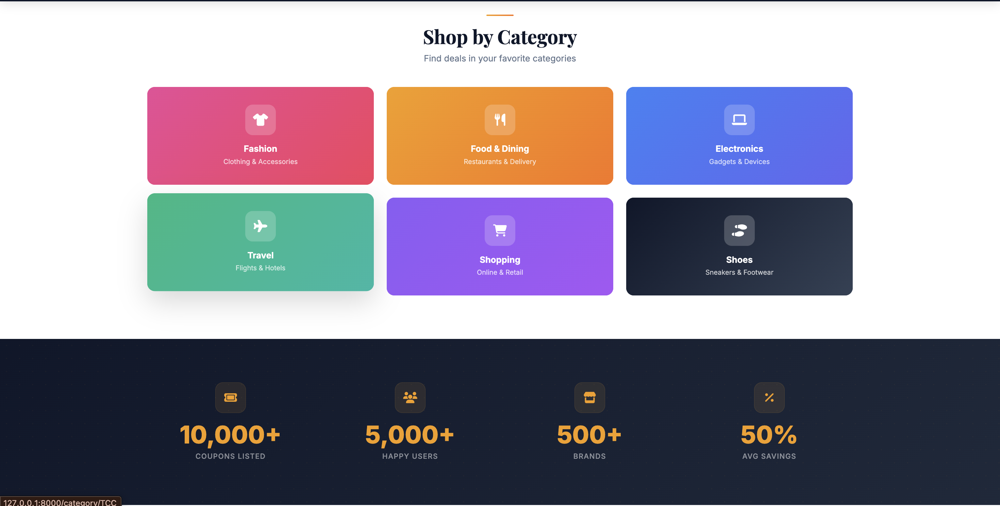
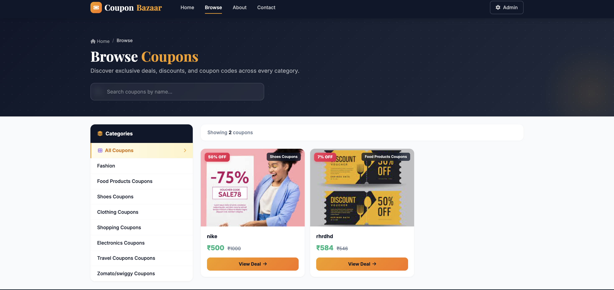

<div align="center">

# Coupon Bazaar

### Buy & Sell Unused Coupons — Save Smart, Waste Nothing

A full-stack coupon marketplace built with Django where users can buy discounted coupons and sell their unused ones — turning expired deals into real savings.

[Live Demo](#) · [Report Bug](../../issues) · [Request Feature](../../issues)

---



</div>

## The Problem

Every year, **billions of rupees worth of coupons go unused** across India. Think about it:

- You get a **Zomato 50% off** coupon but you prefer Swiggy — it expires worthless
- Your friend has a **Nike 40% off** code but doesn't need shoes — wasted
- Brands like Amazon, Flipkart, and MakeMyTrip send discount codes that **sit in inboxes until they expire**
- Credit card companies bundle coupons that most cardholders **never redeem**

Meanwhile, someone out there is about to buy the exact product at full price — **not knowing a discount exists**.

**The result?** Consumers lose money. Brands lose conversions. Everyone loses.

**Coupon Bazaar** fixes this by creating a marketplace where:
- **Sellers** list their unused coupons and earn money instead of letting them expire
- **Buyers** get verified discount codes at a fraction of the original price
- **Everyone saves** — the seller earns, the buyer saves, and no coupon goes to waste

It's the **OLX for coupons** — simple, peer-to-peer, and built for India.

## Screenshots

<div align="center">

### Shop by Category & Stats
Browse deals across Fashion, Food, Electronics, Travel, Shopping, and more.



### Testimonials & CTA
Real users sharing their savings experience.


### Browse Coupons
Full catalog with category filtering, search, discount badges, and deal cards.



</div>

## Features

- **Coupon Catalog** — Browse coupons across 8 categories with live search and filtering
- **Category Filtering** — Fashion, Food, Electronics, Travel, Shopping, Shoes, Clothing, Zomato/Swiggy
- **Coupon Detail Pages** — View full details, copy coupon codes, share deals
- **Discount Calculation** — Auto-calculated discount percentages on every coupon
- **Admin Dashboard** — Django admin panel to manage all coupons, categories, and users
- **Responsive Design** — Fully responsive UI with animations, particles, and smooth transitions
- **Search** — Client-side instant search across all coupon listings

## Tech Stack

| Layer | Technology |
|-------|-----------|
| **Backend** | Django 4.2, Python 3.x |
| **Frontend** | HTML5, CSS3, Bootstrap 5.3, JavaScript |
| **Database** | SQLite (dev) / PostgreSQL (prod-ready) |
| **Images** | Pillow for image processing |
| **Fonts** | Inter, Playfair Display (Google Fonts) |
| **Icons** | Font Awesome 6 |

## Project Structure

```
Coupon-Bazaar/
├── ec/                     # Django project settings
│   ├── settings.py         # Configuration with dotenv
│   ├── urls.py             # Root URL routing
│   └── wsgi.py
├── app/                    # Main application
│   ├── models.py           # Product/Coupon model with 8 categories
│   ├── views.py            # Home, Browse, Category, Detail, About, Contact
│   ├── urls.py             # App URL patterns
│   ├── admin.py            # Admin configuration
│   ├── templates/app/      # All HTML templates
│   │   ├── base.html       # Base layout (navbar, footer, CSS system)
│   │   ├── home.html       # Landing page with hero, categories, stats
│   │   ├── browse.html     # Coupon catalog with sidebar filters
│   │   ├── coupon_detail.html  # Individual coupon page
│   │   ├── about.html      # About page
│   │   └── contact.html    # Contact page
│   └── static/app/         # Static assets (CSS, JS, images)
│       ├── css/
│       ├── js/
│       └── images/         # Banner and product images
├── media/                  # Uploaded coupon images
├── screenshots/            # README screenshots
├── .env.example            # Environment variables template
├── .gitignore
├── requirements.txt
└── manage.py
```

## Getting Started

### Prerequisites

- Python 3.10+
- pip

### Installation

1. **Clone the repository**
   ```bash
   git clone https://github.com/sidd707/Coupon-Bazaar.git
   cd Coupon-Bazaar
   ```

2. **Create virtual environment**
   ```bash
   python -m venv venv
   source venv/bin/activate   # On Windows: venv\Scripts\activate
   ```

3. **Install dependencies**
   ```bash
   pip install -r requirements.txt
   ```

4. **Set up environment variables**
   ```bash
   cp .env.example .env
   ```

5. **Run migrations**
   ```bash
   python manage.py migrate
   ```

6. **Create superuser** (to add coupons via admin)
   ```bash
   python manage.py createsuperuser
   ```

7. **Start the server**
   ```bash
   python manage.py runserver
   ```

8. **Open in browser**
   ```
   http://127.0.0.1:8000/
   ```

   Add coupons via admin panel: `http://127.0.0.1:8000/admin/`

## Environment Variables

| Variable | Description |
|----------|-------------|
| `DJANGO_SECRET_KEY` | Django secret key for cryptographic signing |
| `DEBUG` | Debug mode (`True` for development) |
| `ALLOWED_HOSTS` | Comma-separated list of allowed hosts |

## How It Works

```
┌─────────────┐     ┌──────────────┐     ┌─────────────┐
│   Seller     │     │   Coupon     │     │   Buyer     │
│  has unused  │────▶│   Bazaar    │◀────│  wants a    │
│   coupon     │     │  marketplace │     │   deal      │
└─────────────┘     └──────────────┘     └─────────────┘
       │                    │                    │
   Lists coupon        Connects both         Buys coupon
   earns money         sides safely         saves money
```

## Author

**Siddharth Patel** — Full-Stack Developer

## Contributing

1. Fork the repository
2. Create your feature branch (`git checkout -b feature/amazing-feature`)
3. Commit your changes (`git commit -m 'Add amazing feature'`)
4. Push to the branch (`git push origin feature/amazing-feature`)
5. Open a Pull Request

## License

Distributed under the MIT License.

---

<div align="center">

**Built with Django & Bootstrap** · Every coupon saved is money earned.

</div>
